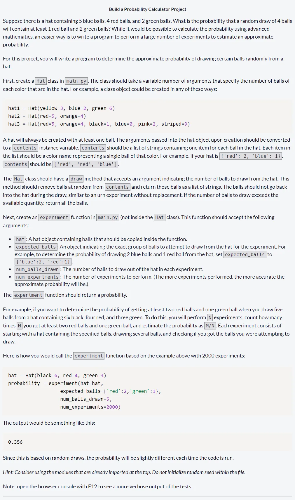
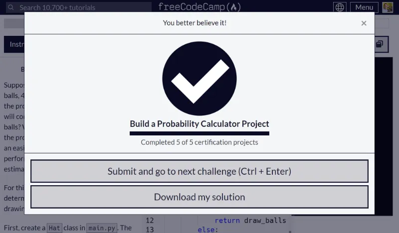
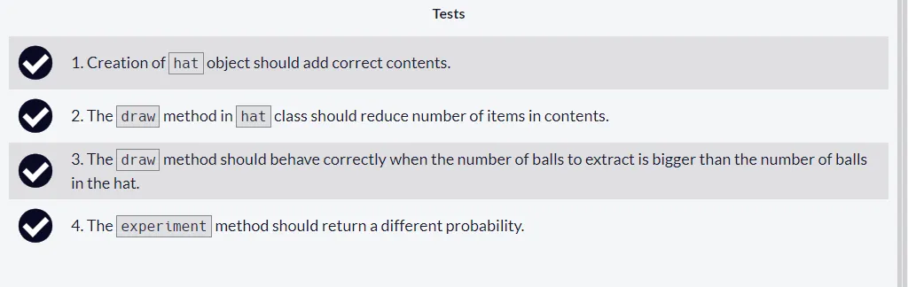

# Build a Probability Calculator Project

Quinto y último proyecto requisito obligatorio: [Build a Probability Calculator Project](https://www.freecodecamp.org/learn/scientific-computing-with-python/build-a-probability-calculator-project/build-a-probability-calculator-project) necesario para obtener la [freecodecamp Scientific Computing with Python Certification](https://www.freecodecamp.org/learn/scientific-computing-with-python/)

Las siguientes descripciones del proyecto dadas en freecodecamp son vagas por lo que procedo a dejarlas claramente definidas:

- La probabilidad pedida es aquella requerida para obtener **al menos** la cantidad de balls dadas para cada value en el diccionario **expected_balls**

- En el método **draw** y cuando el número de retiros es mayor que la cantidad de balls disponibles, proceder a **vaciar** el arreglo self.contents y retornar una copia con todas las balls.

Con lo anterior claro, el proyecto es posible de realizar de manera sencilla.

## Tabla de Contenidos

- [Build a Probability Calculator Project](#build-a-probability-calculator-project)
  - [Tabla de Contenidos](#tabla-de-contenidos)
  - [Instructions](#instructions)
  - [Proyecto Aprobado](#proyecto-aprobado)
  - [All Tests Passed](#all-tests-passed)
  - [My Solution Code](#my-solution-code)

## Instructions



## Proyecto Aprobado



## All Tests Passed



## My Solution Code

```py
import copy
import random
from typing import Dict
class Hat:
    def __init__(self,**kwargs:Dict[str,int]):
        self.contents=[key  for key in kwargs.keys() for _ in range(kwargs[key])]

    def draw(self, number:int):
        if number > len(self.contents):
            draw_balls =  self.contents[:]
            self.contents.clear()
            return draw_balls
        else:
            draw_balls = []

            for _ in range(number):
                i_random = random.randint(0,len(self.contents)-1)
                draw_balls.append(self.contents[i_random])
                self.contents.pop(i_random)

            return draw_balls


def experiment(hat: Hat, expected_balls: Dict[str,int], num_balls_drawn: int, num_experiments:int):

    count=0
    for _ in range(num_experiments):
        copy_hat = copy.deepcopy(hat)
        balls_drawn = copy_hat.draw(num_balls_drawn)

        for key,value in expected_balls.items():
            if balls_drawn.count(key) < value:
                break
        else:
                count+=1

    return count/num_experiments
```
